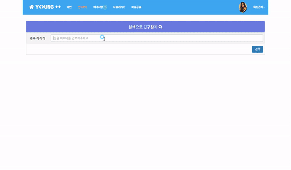

# ***JspBlog-fileServer :eyes:***
*This repository introduces a Blog-fileServer based on JSP Ajax.*
 
> http://pym7857.cafe24.com

## ***Development environment***
* *OS : Windosw 10*
* *Language : Java*
* *MySQL ver8.0.18*
* *BootStrap 3.3.7*
* *Tomcat Server v8.5*

## ***Web Demo***
### ***1. intro***
 
### ***2. indexPage & BoardView***
 
### ***3. fileDownload & Streaming***
 
### ***4. msg***
 

